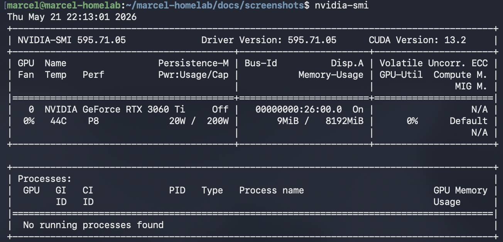
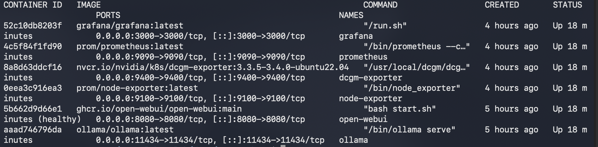
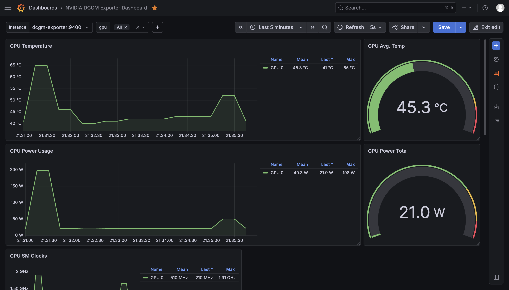
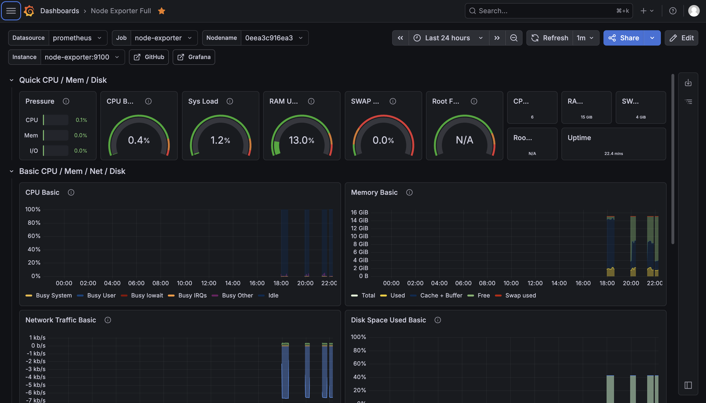
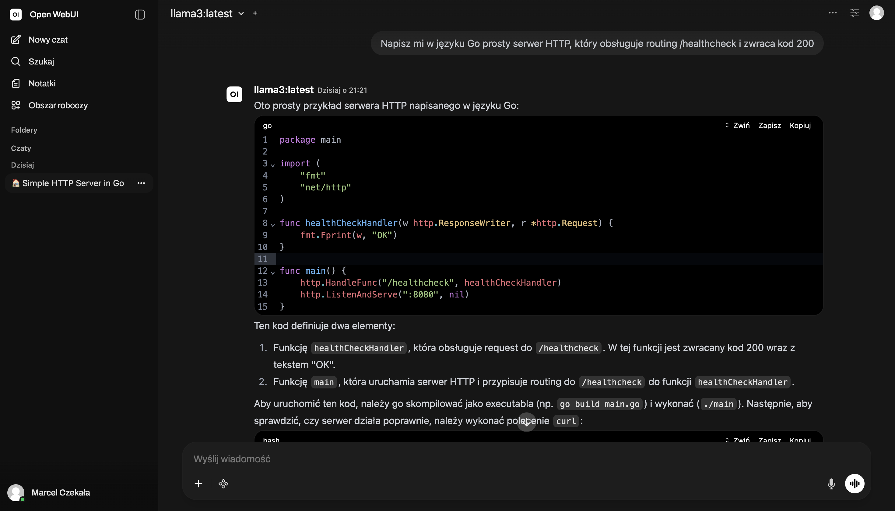

# marcel-homelab

My personal 24/7 homelab for learning Linux System Administration, Docker and GPU computing.

## About the project

Building hands-on experience with server management, containerization and AI infrastructure on my own hardware.

## Current Stack

### AI & GPU
- **Ollama** + **Open WebUI** — local LLMs with full GPU acceleration (RTX 3060 Ti 8GB)

### Monitoring
- Prometheus + Grafana
- NVIDIA DCGM Exporter (GPU metrics)
- Node Exporter

### Tools
- Docker & Docker Compose
- Portainer
- Tailscale

## Screenshots

**nvidia-smi**

**Running containers (docker ps)**

**GPU Monitoring Dashboard**

**System Overview**

**Open WebUI**

## Hardware
- CPU: AMD Ryzen 5 3500
- GPU: NVIDIA RTX 3060 Ti 8 GB
- RAM: 16 GB
- Storage: 256 GB SSD + 1 TB HDD

## Next steps
- Ansible playbooks
- Custom Bash automation scripts
- More security tools (CrowdSec, etc.)

---

Last updated: May 2026
=======
